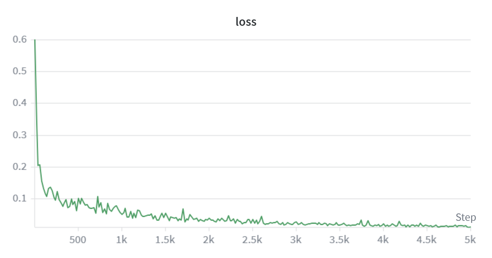
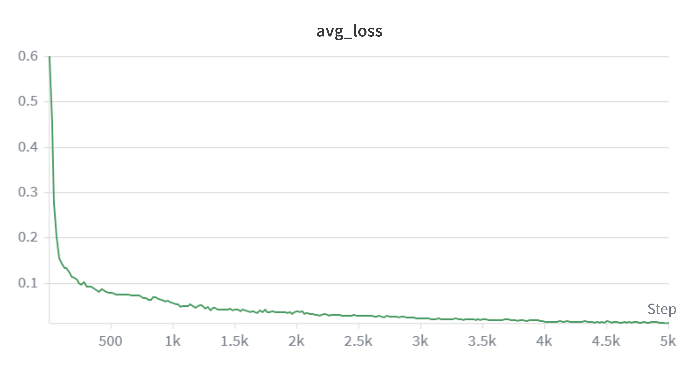
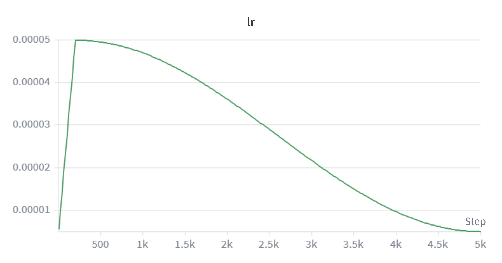
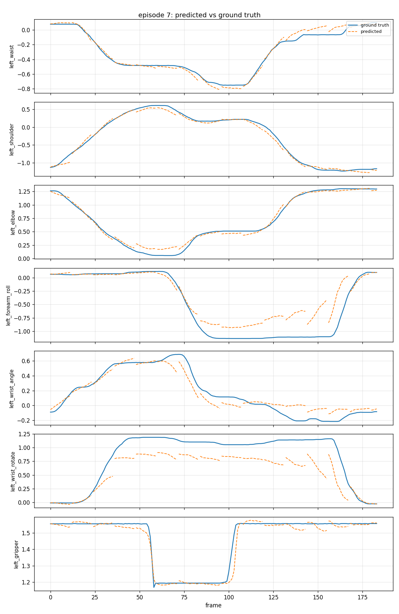
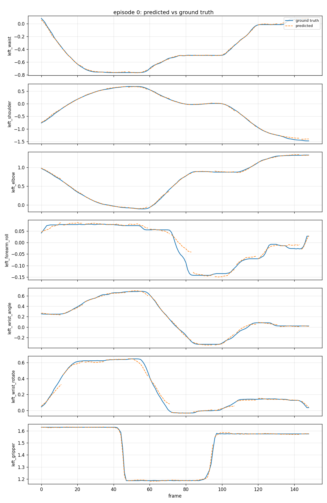

# TurboVLA ALOHA Finetune — A100 Results

All numbers below are read directly from the run artifacts in
[`aloha_results/`](aloha_results/) (JSON/CSV) or from the executed cell
output embedded in [`TurboVLA_ALOHA_Colab.ipynb`](TurboVLA_ALOHA_Colab.ipynb)
— every figure states its source file.

## 1. Overview & objective

This round finetunes TurboVLA on a single-arm ALOHA manipulation dataset
(`thanh0210/aloha_left_arm_pick_carrot_put_cup_easy_task`, 130 episodes,
7-D absolute joint-position actions — 6 arm joints + 1 continuous gripper
dim — 2 camera views), initialized by transfer from the LIBERO
`object.pth` checkpoint.

The round's goal was to move from the earlier local overfit smoke test
(a single 8-episode training set with no real held-out split) to a real
train/val split on the full dataset, on an A100, with the vision backbone
(DINOv3) unfrozen — i.e. to get the first genuine generalization signal
(held-out val NMSE) for this pipeline, plus A100 inference-latency numbers
to compare against the existing RTX 4050 local profile.

## 2. Setup

**Dataset** (source: `TurboVLA_ALOHA_Colab.ipynb`, section "3. Train/val
split", cell 15 output):
- 130 total episodes, split by whole episode (never by frame) with
  `val_ratio=0.15`, `seed=42` → **110 train / 20 val** episodes.
- Train split covers 15,858 frames (source: finetune run log, `dataset:
  episodes=[...], frames=15858`).
- 2 camera views per frame (`observation.images.color.high`,
  `observation.images.color.wrist_left`).
- Action space: 7-D absolute joint position (`j0`–`j5` = arm joints,
  `j6` = continuous gripper, not binarized).

**Model config** (source: `experiments/aloha/finetune.py` defaults +
`turbovla/models/configuration.py`, and the finetune run log):
- `action_dim=7`, `state_dim=7`, `chunk_size=12`, `num_views=2`.
- Vision backbone: `facebook/dinov3-vitb16-pretrain-lvd1689m` (ViT-B).
- Text backbone: `google-bert/bert-base-uncased` (frozen this round).
- Interaction hidden dim: 256 (`InteractionConfig.hidden_dim` default).

**Init strategy** (source: finetune run log): loaded from
`pretrained/TurboVLA/checkpoints/libero/object.pth`. Source and target
both have 672 keys; 669 transferred directly, 3 re-initialized
(`action_head.state_projection.net.{0.weight,0.bias,1.weight}`) because
the LIBERO checkpoint's state dim is 8 vs this task's 7 — exactly the
expected 3-key deviation, 669/672 transferred.

**Full A100 run config** (source: `TurboVLA_ALOHA_Colab.ipynb`, section
"5. Full A100 finetune", `FULL_RUN_HPARAMS` cell + run log):

| Setting | Value |
|---|---|
| `--no_freeze_vision_encoder` | set (DINOv3 unfrozen) |
| `--no_freeze_text_encoder` | not set (BERT stays frozen) |
| `batch_size` / `grad_accum_steps` | 16 / 1 |
| `max_steps` | 5000 |
| `warmup_steps` | 200 |
| `head_lr` / `dinov3_lr` | 2e-4 / 5e-5 |
| precision | `bf16_amp` (training autocast) |
| trainable / total params | 106,589,973 / 216,072,981 |

## 3. Training

Loss curve milestones (source: `TurboVLA_ALOHA_Colab.ipynb`, full-run
training cell output — `step=.../5000 loss=... avg=... lr=...` log lines;
`loss` = current-step loss, `avg` = running average):

| step | loss | avg | lr |
|---|---|---|---|
| 1 | 0.601 | 0.601 | 5.45e-06 |
| 200 | 0.126 | 0.113 | 5.00e-05 |
| 500 | 0.103 | 0.081 | 4.96e-05 |
| 1000 | 0.052 | 0.057 | 4.70e-05 |
| 1500 | 0.055 | 0.043 | 4.23e-05 |
| 2000 | 0.040 | 0.040 | 3.61e-05 |
| 2500 | 0.037 | 0.030 | 2.90e-05 |
| 3000 | 0.029 | 0.024 | 2.17e-05 |
| 4000 | 0.023 | 0.017 | 9.65e-06 |
| 5000 (final) | 0.0125 | 0.0138 | 5.00e-06 |

- **Final loss:** step=5000, loss=0.01251, avg=0.01375.
- **Peak VRAM:** 5.889 GB (source: training log, `peak VRAM allocated:
  5.889 GB`).
- **Wall-clock time:** 1599.3 s (~26.7 min) for 5000 steps (source:
  training log, `total steps: 5000, total time: 1599.3s`).

Per-step loss decreases roughly monotonically (with normal step-to-step
noise) from ~0.6 at step 1 to ~0.01 by step 5000.

The running average smooths the noise and confirms the same monotonic
decrease, flattening out after roughly step 3500 as `dinov3_lr`/`head_lr`
decay toward their floor.

Learning rate follows the configured schedule: linear warmup to peak over
the first 200 steps, then cosine decay for the remaining 4800 steps.

## 4. Open-loop evaluation (A100 run — A100 data only)

Source: `aloha_results/aloha_eval_full/val/openloop_summary.json` (20
held-out val episodes, `checkpoint=finetune_step_5000.pth`,
`nmse_gate_threshold=0.1`) and
`aloha_results/aloha_eval_full/train_sample/openloop_summary.json` (a
20-episode sample of the 110 train episodes, same checkpoint).

**Val (20 held-out episodes, 2883 chunk points) vs. train-sample
(20-episode sample of the 110 train episodes, sanity fit, 3139 chunk
points), per-joint:**

| Split | Metric | j0 | j1 | j2 | j3 | j4 | j5 | j6 (gripper) | **total** |
|---|---|---|---|---|---|---|---|---|---|
| Val | NMSE | 0.0210 | 0.0200 | 0.0187 | 0.1096 | 0.0492 | 0.1147 | 0.0667 | **0.0571** |
| Val | MSE | 0.0022 | 0.0092 | 0.0036 | 0.0048 | 0.0049 | 0.0071 | 0.0023 | **0.0049** |
| Val | MAE | 0.0296 | 0.0486 | 0.0391 | 0.0253 | 0.0474 | 0.0358 | 0.0163 | **0.0346** |
| Train | NMSE | 0.0149 | 0.0151 | 0.0069 | 0.0064 | 0.0083 | 0.0063 | 0.0064 | **0.0092** |
| Train | MSE | 0.0015 | 0.0068 | 0.0013 | 0.0005 | 0.0008 | 0.0006 | 0.0002 | **0.0017** |
| Train | MAE | 0.0113 | 0.0240 | 0.0133 | 0.0115 | 0.0133 | 0.0127 | 0.0056 | **0.0131** |

Representative single-episode plots (each shows all 7 joints,
predicted vs. recorded, for one episode; full 20+20 per-episode
JSON/PNG pairs are in `aloha_results/aloha_eval_full/{val,train_sample}/`):

*Val episode 7 — predicted vs. recorded joint trajectories, held-out.*

*Train-sample episode 0 — predicted vs. recorded, training data.*

## 5. Latency

**A100** (source: `aloha_results/aloha_latency_a100/latency_{bf16,fp32}.csv`,
`profile_latency.py --per-layer`, batch=1, warmup=10, iters=50, checkpoint
`finetune_step_5000.pth`):

| precision | text_encoder | vision | vision_language_interaction | action_head | **end_to_end** | Hz |
|---|---|---|---|---|---|---|
| bf16 | 12.44 ms (22.4%) | 25.93 ms (46.7%) | 12.24 ms (22.1%) | 4.04 ms (7.3%) | **55.50 ms** | 18.0 |
| fp32 | 9.07 ms (19.3%) | 25.41 ms (54.0%) | 9.21 ms (19.6%) | 2.70 ms (5.8%) | **47.04 ms** | 21.3 |

**RTX 4050** (source:
`outputs/aloha_latency/latency_{bf16,fp32}.csv`, local repo path, not
committed under `notebooks/` per the A100/local separation — measured
RTX 4050, 2026-08-05, same `profile_latency.py --per-layer` command,
batch=1, warmup=10, iters=50):

| precision | text_encoder | vision | vision_language_interaction | action_head | **end_to_end** | Hz |
|---|---|---|---|---|---|---|
| bf16 | 8.21 ms (22.2%) | 16.65 ms (45.0%) | 8.78 ms (23.7%) | 2.78 ms (7.5%) | **37.01 ms** | 27.0 |
| fp32 | 6.55 ms (19.8%) | 17.24 ms (52.1%) | 6.83 ms (20.6%) | 2.01 ms (6.1%) | **33.10 ms** | 30.2 |